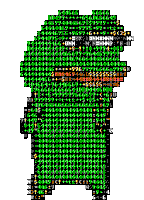

### Hi there 👋

    

  <h2 align="center">About me 😄</h2>

  

Hi there, I'm Mikhail U. 👋 \
Here you can read some short info about me:

⚡ Middle PHP and Go developer \
📫 Welcome to my [packages](https://packagist.org/users/Mishanki/packages/)
and [telegram channel](https://t.me/Mishanki12)

  

<!--
**Mishanki/Mishanki** is a ✨ _special_ ✨ repository because its `README.md` (this file) appears on your GitHub profile.

Here are some ideas to get you started:

- 🔭 I’m currently working on ...
- 🌱 I’m currently learning ...
- 👯 I’m looking to collaborate on ...
- 🤔 I’m looking for help with ...
- 💬 Ask me about ...
- 📫 How to reach me: ...
- 😄 Pronouns: ...
- ⚡ Fun fact: ...
-->
